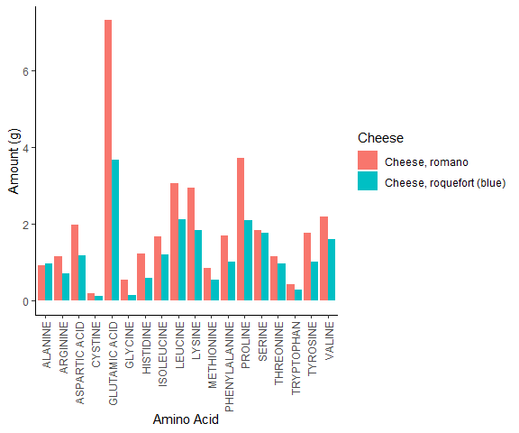

<!-- README.md is generated from README.Rmd. Please edit that file -->
[](https://circleci.com/gh/jufil19/nutrientr)

# nutrientr

<!-- badges: start -->
<!-- badges: end -->

## Description

The `nutrientr` package is an R wrapper for the [Canadian Nutrient File
(CNF) API](https://hc-sc.api.canada.ca/en/detail?api=cnf). It contains
information about commonly consumed foods in Canada. There are eight
different endpoints that give access to different types of information.

-   The food endpoint gives a list of food ids and their corresponding
    description (name).
-   The nutrientamount endpoint gives lists of the amounts of different
    nutrients in the foods.
-   The nutrientgroup endpoint gives nutrient groups (eg. carbohydrates,
    others), and their corresponding ids.
-   The nutrientname endpoint give the ids of different nutrients and
    their corresponding names, symbols, units, etc.
-   The nutrientsource endpoint gives information about where
    information about nutrients was pulled from (eg. FDA).
-   The refuseamount endpoint gives information about the amount of food
    waste for different foods (eg. the inedible portion of the foods -
    like bones).
-   The servingsize endpoint gives the servings sizes for the different
    foods.
-   The yieldamount endpoint gives the amount of food needed to get the
    desired quantity of end product (eg. the amount of dried gravy
    powder to make 100 mLs).

## Installation

The `nutrientr` package can be installed and loaded in your library via
[CRAN](https://cran.r-project.org/) using the following commands :

    install.packages('nutrientr')
    library(nutrientr)

You can also install the development version available on Github using
the following code :

    # install.packages("devtools")
    devtools::install_github("jufil19/nutrientr")

## Getting Started - API Access Key

In order to use the `nutrientr` package, you will need to get an API key
from the [Canada Open Data API
Store](https://hc-sc.api.canada.ca/en/detail?api=cnf). Once you have
this, you can either set is as a system environment variable using
`Sys.setenv(CN_API = 'your_API_key_here')` or pass it as a parameter to
the functions.

## Usage

The `nutrientr` package contains several functions that wrap the CNF API
endpoints listed above in the description. The following documentation
will give examples of how to use them.

### `get_food()`

The `get_food()` function retrieves food information from the CNF using
the following arguments:

-   **foodCode**: The id for the food you are searching for. If none is
    passed, then a list of all foods in the database will be returned.  
-   **lang**: Define in which language you would like the response to be
    (can be ‘en’ or ‘fr’).
-   **apiKey**: If an API key is not set in the environment, an access
    key can be passed directly into a function.

An example of using `get_food()` to search for the food with food_code
as 5 would be as follows:

``` r
get_food(foodCode = 5)
#> # A tibble: 1 x 2
#>   food_code food_description                
#>       <int> <chr>                           
#> 1         5 Chinese dish, chow mein, chicken
```

### Nutrient Information: `get_nutrientamount()`, `get_nutrientgroup()`, `get_nutrientname()` and `get_nutrientsource()`

The `get_nutrientamount()`, `get_nutrientgroup()` , `get_nutrientname()`
and `get_nutrientsource()` functions returns nutrient amount information
from the CNF using the following parameters.

-   **foodCode**: The id for the food you are searching for. If none is
    passed, then a list of all foods in the database will be returned.  
-   **lang**: Define in which language you would like the response to be
    (can be ‘en’ or ‘fr’).
-   **apiKey**: If an API key is not set in the environment, an access
    key can be passed directly into a function.
-   **nutrientGroupId**: The Nutrient Group ID.
-   **nutrientNameId**: The ID for the nutrient name.
-   **nutrientSourceId**: The id for the source of the nutrient
    information.

If a user wanted to search and return the all nutrient amount
information, `get_nutrientamount()` could be used, though there is a lot
of data (500K lines), so this will take a long time. Instead, we will
look for food #2314 (Spinach Souffle):

``` r
head(get_nutrientamount(foodCode = 2314))
#> # A tibble: 6 x 7
#>   food_code nutrient_value standard_error number_observation nutrient_name_id
#>       <int>          <dbl>          <int>              <int>            <int>
#> 1      2314              0              0                  0              221
#> 2      2314              0              0                  0              262
#> 3      2314              0              0                  0              263
#> 4      2314              0              0                  0              431
#> 5      2314              0              0                  0              615
#> 6      2314              0              0                  0              620
#> # ... with 2 more variables: nutrient_web_name <chr>, nutrient_source_id <int>
```

If you want to find the nutrient group information for nutrient_group_id
7 call `get_nutrientgroup()`:

``` r
get_nutrientgroup(nutrientGroupId = 7)
#> # A tibble: 1 x 3
#>   nutrient_group_id nutrient_group_name nutrient_group_order
#>               <int> <chr>                              <int>
#> 1                 7 Other components                       7
```

To see all of the nutrient groups, don’t provide a nutrient_group_id:

``` r
get_nutrientgroup()
#> # A tibble: 7 x 3
#>   nutrient_group_id nutrient_group_name nutrient_group_order
#>               <int> <chr>                              <int>
#> 1                 1 Proximates                             1
#> 2                 2 Other Carbohydrates                    2
#> 3                 3 Minerals                               3
#> 4                 4 Vitamins                               4
#> 5                 5 Amino Acids                            5
#> 6                 6 Lipids                                 6
#> 7                 7 Other components                       7
```

If you want to find the nutrient name information for nutrientNameId 550
call `get_nutrientname(nutrientNameId = 550)`:

``` r
get_nutrientname(nutrientNameId = 550)
#> Warning: `as.tibble()` was deprecated in tibble 2.0.0.
#> Please use `as_tibble()` instead.
#> The signature and semantics have changed, see `?as_tibble`.
#> This warning is displayed once every 8 hours.
#> Call `lifecycle::last_lifecycle_warnings()` to see where this warning was generated.
#> # A tibble: 1 x 10
#>   nutrient_name_id nutrient_symbol nutrient_name unit  nutrient_code tagname
#>              <int> <chr>           <chr>         <chr>         <int> <chr>  
#> 1              550 ASPA            ASPARTAME     mg              550 ""     
#> # ... with 4 more variables: nutrient_decimals <int>, nutrient_web_order <int>,
#> #   nutrient_web_name <chr>, nutrient_group_id <int>
```

If you want to find the nutrient source information for all nutrient
sources, call `get_nutrientsource()`:

``` r
head(get_nutrientsource())
#> # A tibble: 6 x 3
#>   nutrient_source_id nutrient_source_description              nutrient_source_c~
#>                <int> <chr>                                                 <int>
#> 1                108 Imputed data that USDA has deleted                       18
#> 2                  3 Nutrient analyzed in a Canadian governm~                  3
#> 3                  2 Nutrient calculated from data other tha~                  2
#> 4                  1 Nutrient levels changed to meet the can~                  1
#> 5                  0 No change from USDA                                       0
#> 6                 12 Nutrient value is an assumed zero                        12
```

If you want to find the nutrient source information for nutrient source
number 108 call `get_nutrientsource(nutrientSourceId = 108)`:

``` r
get_nutrientsource(nutrientSourceId = 108)
#> # A tibble: 1 x 3
#>   nutrient_source_id nutrient_source_description        nutrient_source_code
#>                <int> <chr>                                             <int>
#> 1                108 Imputed data that USDA has deleted                   18
```

### `get_refuseamount()`

The `get_refuseamount()` function retrieves refuse amount information
from the CNF using the following parameters:

-   **foodCode**: The id for the food you are searching for. If none is
    passed, then a list of all foods in the database will be returned.  
-   **lang**: Define in which language you would like the response to be
    (can be ‘en’ or ‘fr’).
-   **apiKey**: If an API key is not set in the environment, an access
    key can be passed directly into a function.

If you want to find the refuse amount information for all foods where
this information is available, call `get_refuseamount()`:

``` r
head(get_refuseamount())
#> # A tibble: 6 x 4
#>   refuse_amount food_code food_description                          refuse_name 
#>           <dbl>     <int> <chr>                                     <chr>       
#> 1             0        44 Cheese, ricotta, with partly skimmed milk total refuse
#> 2             0        45 Cheese, romano                            total refuse
#> 3             0        46 Cheese, roquefort (blue)                  total refuse
#> 4             0        47 Cheese, swiss (emmental)                  total refuse
#> 5             0        48 Cheese, tilsit, with whole milk           total refuse
#> 6             0        51 Cheese, processed, cheddar, cold pack     total refuse
```

### Serving Size

The `get_servingsize()` functions all retrieve serving sizes information
from the CNF using the following parameters:

-   **foodCode**: List of foodCode of foods available. The values depend
    on each endpoint.  
-   **lang**: Define which language you would like the response to be in
    query string
-   **apiKey**: If an API key is not set in the environment, an access
    key can be passed directly into a function.

If you want to find the serving size information for all foods where
this information is available, call `get_servingsize()`:

``` r
get_servingsize()
#> # A tibble: 16,656 x 4
#>    conversion_factor_value food_code food_description            measure_name   
#>                      <dbl>     <int> <chr>                       <chr>          
#>  1                  1.31          44 Cheese, ricotta, with part~ 125ml          
#>  2                  0.423         45 Cheese, romano              100ml grated   
#>  3                  1.06          45 Cheese, romano              250ml          
#>  4                  0.5           45 Cheese, romano              50g            
#>  5                  0.0634        45 Cheese, romano              15ml           
#>  6                  0             45 Cheese, romano              no serving spe~
#>  7                  0.571         46 Cheese, roquefort (blue)    100ml crumbled 
#>  8                  1.43          46 Cheese, roquefort (blue)    250ml          
#>  9                  0.5           46 Cheese, roquefort (blue)    50g            
#> 10                  0             46 Cheese, roquefort (blue)    no serving spe~
#> # ... with 16,646 more rows
```

### Yield Amount

The `get_yieldamount()`function retrieves yield information from the CNF
using the following arguments:

-   **foodCode**: List of foodCode of foods available. The values depend
    on each endpoint.  
-   **lang**: Define which language you would like the response to be in
    query string
-   **apiKey**: If an API key is not set in the environment, an access
    key can be passed directly into a function.

If you want to find the yield amount information for all foods where
this information is available, call `get_yieldamount()`:

``` r
head(get_yieldamount())
#> # A tibble: 6 x 4
#>   yield_amount food_code food_description                yield_name             
#>          <dbl>     <int> <chr>                           <chr>                  
#> 1         1.32        57 Dessert topping (non dairy), p~ amount to make 15ml    
#> 2        22.0         57 Dessert topping (non dairy), p~ amount to make 250ml   
#> 3        33.5         66 Milk, dry whole                 amount to make 250ml   
#> 4        25.3         67 Milk, dry, buttermilk, sweet c~ amount to make 250ml   
#> 5       133.         112 Milk, evaporated, skim, canned~ amount to make 250ml   
#> 6        24.3        115 Milk, dry, skim, powder, insta~ amount to make 250ml o~
```

## A Fully Worked Example

Let’s say we’re super interested in comparing Roquefort Cheese (food
code = 46), with Romano Cheese (food code = 45). I know these codes from
looking through the full list (calling `get_food()`), to demonstrate,
I’ll get the names for these two cheeses using their codes.

``` r
#The API doesn't accept multiple IDs at once, so we have to make two queries. 
rbind(get_food(foodCode = 45), get_food(foodCode = 46))
#> # A tibble: 2 x 2
#>   food_code food_description        
#>       <int> <chr>                   
#> 1        45 Cheese, romano          
#> 2        46 Cheese, roquefort (blue)
```

Now that we’ve confirmed that we have two types of cheese, let’s see the
serving sizes for both.

``` r
rbind(get_servingsize(foodCode = 45), get_servingsize(foodCode = 46))
#> # A tibble: 9 x 4
#>   conversion_factor_value food_code food_description         measure_name       
#>                     <dbl>     <int> <chr>                    <chr>              
#> 1                  0.423         45 Cheese, romano           100ml grated       
#> 2                  1.06          45 Cheese, romano           250ml              
#> 3                  0.5           45 Cheese, romano           50g                
#> 4                  0.0634        45 Cheese, romano           15ml               
#> 5                  0             45 Cheese, romano           no serving specifi~
#> 6                  0.571         46 Cheese, roquefort (blue) 100ml crumbled     
#> 7                  1.43          46 Cheese, roquefort (blue) 250ml              
#> 8                  0.5           46 Cheese, roquefort (blue) 50g                
#> 9                  0             46 Cheese, roquefort (blue) no serving specifi~
```

Cool, now we can convert between different ways to serve these two types
of cheese using the base measurement of 50g. Next, we’ll check if either
have any refuse amounts or corresponding yields. Since they are both
cheeses and don’t require any preparation, they shouldn’t. This means we
should get 0 for total refuse, and errors for the yields saying the
queries are invalid since there’s no info in the database.

``` r
get_refuseamount(foodCode = 45)
#> # A tibble: 1 x 4
#>   refuse_amount food_code food_description refuse_name 
#>           <dbl>     <int> <chr>            <chr>       
#> 1             0        45 Cheese, romano   total refuse
get_refuseamount(foodCode = 46)
#> # A tibble: 1 x 4
#>   refuse_amount food_code food_description         refuse_name 
#>           <dbl>     <int> <chr>                    <chr>       
#> 1             0        46 Cheese, roquefort (blue) total refuse
```

``` r
try({
  get_yieldamount(foodCode = 45)
  get_yieldamount(foodCode = 46)
})
#> Error in clean_data(output) : The requested query has no result
```

Now let’s get the nutrition information for both cheeses and compare it.

``` r
head(nutrition)
#> # A tibble: 6 x 20
#>   food_code nutrient_value standard_error number_observation nutrient_name_id
#>       <int>          <dbl>          <int>              <int>            <int>
#> 1        45              0              0                  0              221
#> 2        45              0              0                  0              262
#> 3        45              0              0                  0              263
#> 4        45              0              0                  0              291
#> 5        45              0              0                  0              401
#> 6        45              0              0                  0              431
#> # ... with 15 more variables: nutrient_web_name <chr>,
#> #   nutrient_source_id <int>, nutrient_name_id.y <int>, nutrient_symbol <chr>,
#> #   nutrient_name <chr>, unit <chr>, tagname <chr>, nutrient_decimals <int>,
#> #   nutrient_web_order <int>, nutrient_group_id <int>,
#> #   nutrient_group_name <chr>, nutrient_group_order <int>,
#> #   nutrient_source_description <chr>, nutrient_source_code <int>,
#> #   food_description <chr>
```

Got it! Now we have ample information to plot. As a simple example of
something to look at, let’s compare the amounts of the different amino
acids in the two cheeses. These are what make up proteins, so they
should present in relatively high levels in cheese.

``` r
filtered <- nutrition |> dplyr::filter(nutrient_group_name == "Amino Acids")
ggplot(data = filtered, aes(x=nutrient_name, y=nutrient_value, fill = food_description))+
  geom_bar(stat = 'summary', fun = sum, position = "dodge") +
  theme_classic() + 
  theme(axis.text.x = element_text(angle = 90, vjust = 0.5, hjust=1)) +
  labs(x = "Amino Acid", y = "Amount (g)", fill = "Cheese")
```



Awesome! We can see that romano cheese has higher levels of almost all
amino acids, particularly glutamic acid.

## Contributing

If you are interested in contributing to this project, please refer to
the
[CONTRIBUTING.md](https://github.com/jufil19/nutrientr/blob/main/CONTRIBUTING.md)
file in this repository. Also, please note that anyone who wishes to do
so must respect the following [Code of
Conduct](https://github.com/jufil19/nutrientr/blob/main/CODE_OF_CONDUCT.md).

## License

[MIT](https://choosealicense.com/licenses/mit/)
